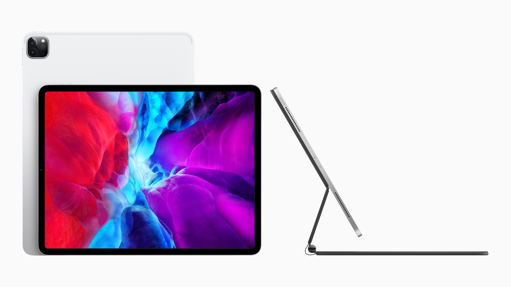
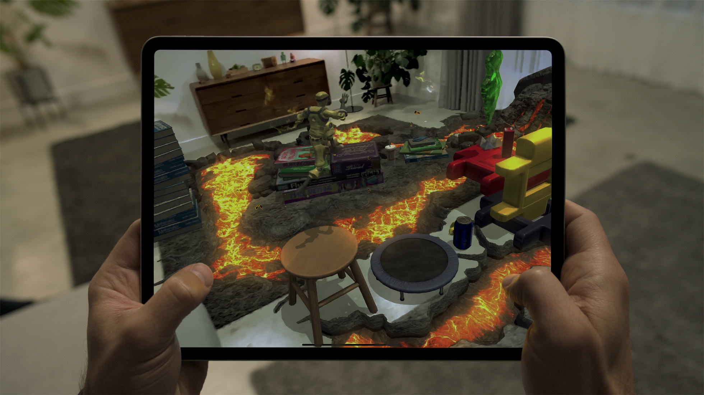
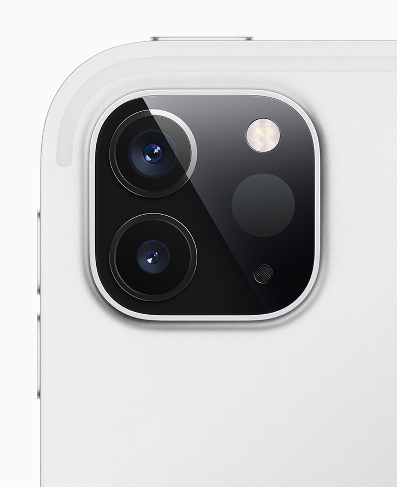
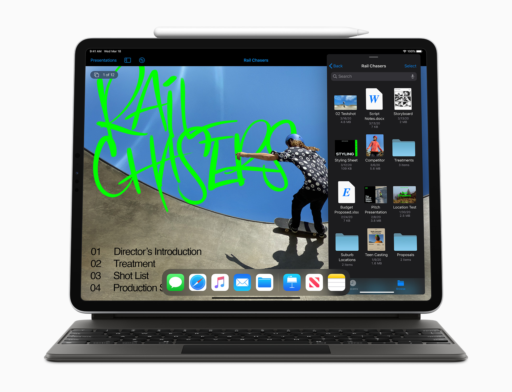
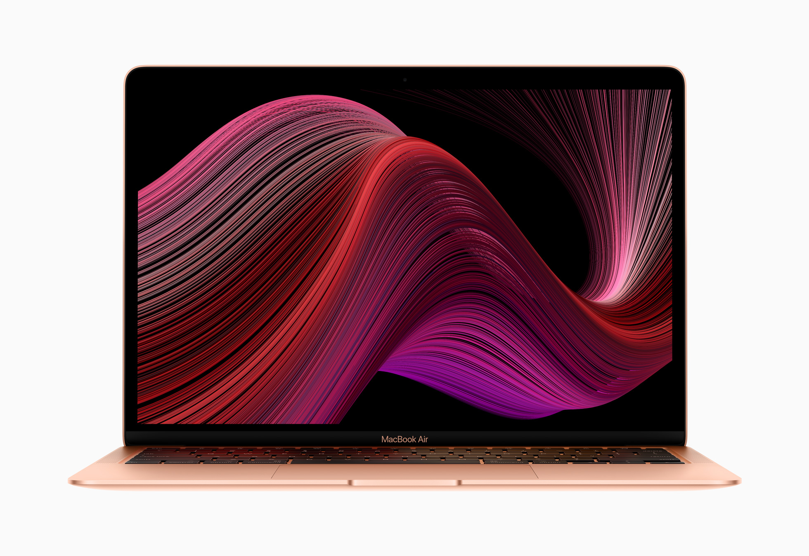
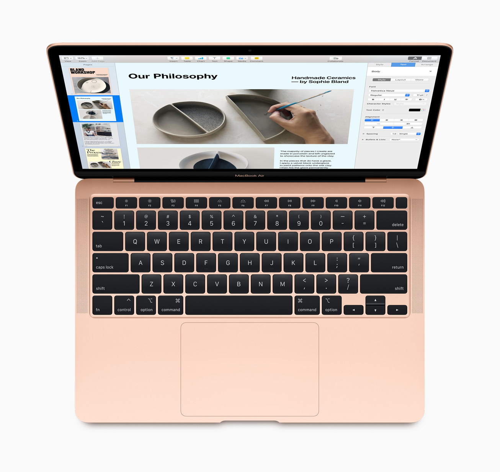
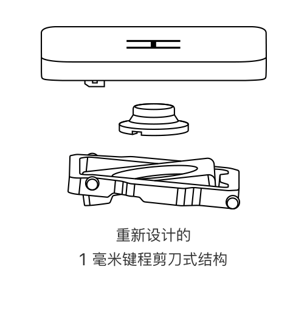

# 2020-03-21特刊
# iPad Pro
>专为 iPad Pro 设计的全新妙控键盘采用悬浮式设计,配备背光按键和触控板,为 iPad 带来了更出色的输入体验

Apple 今日推出了新款 iPad Pro.这款 Apple 最先进的 iPad 配备了 A12Z 仿生芯片,比大多数 Windows 笔记本电脑速度更快,性能更强劲.它还加入了超广角摄像头,录音棚级麦克风,更突破性地配备了具有先进深度感应功能的激光雷达扫描仪.这一切,让 iPad Pro 能从容应对多种专业级工作,并为专业类照片和视频 app 提供支持.激光雷达扫描仪携手 Pro 级摄像头,运动传感器,专业级性能,专业级音频,绚丽的 Liquid 视网膜屏和众多功能强大的 app,让 iPad Pro 成为了体验增强现实 (AR) 的强大装备.新款 iPad Pro 可于近日在 [apple.com.cn](apple.com.cn) 订购.
通过 iPadOS 13.4,Apple 为 iPad 带来了触控板支持,为用户开启了与 iPad 互动的崭新方式.触控板支持并未完全照搬 macOS 的体验,而是专门针对 iPad 进行了重新设计.当用户在触控板上移动手指时,光标会根据所指向的界面元素智能变换形态.触控板还支持多点触控手势,让用户无需抬起手,就可以快速,轻松地操控整个系统.
Apple 今日还推出了适用于 iPad Pro 的全新妙控键盘.这款妙控键盘采用可自如调整角度的悬浮式设计,并配备背光按键和触控板,带来更出色的输入体验.妙控键盘将于 5 月发售.
"新款 iPad Pro 带来了移动计算领域前所未有的先进技术," Apple 全球市场营销高级副总裁 Phil Schiller 表示,"以先进的移动设备显示屏,结合强大性能,Pro 级摄像头,专业级音频,突破性的激光雷达扫描仪,以及自带触控板的全新妙控键盘,为 iPad 带来又一次巨大飞跃.新款 iPad Pro 是如此出类拔萃,我们相信广大用户一定会爱上它." 
"我们通过为 iPadOS 带来触控板支持,让 iPad Pro 能力更强大,用法更多样,"Apple 软件工程高级副总裁 Craig Federighi 表示,"我们经过了仔细斟酌,既将触控板用法巧妙整合到触控优先的环境之中,又保留了用户熟知和喜爱的 iPad 功能和特色.我们很高兴将这种崭新的 iPad 互动方式,带给当今数百万 iPadOS 用户."  
## A12Z 仿生芯片带来专业级性能

iPad Pro 专为 4K 视频剪辑,3D 模型设计这类高要求任务而打造,全新 A12Z 仿生芯片则进一步提升了这种能力.A12Z 仿生芯片中的 8 核图形处理器,加上增强的散热架构和精心调校的性能控制器,让新款 iPad Pro 的性能表现尤为抢眼.8 核图形处理器与支持下一代 app 的强大神经网络引擎相结合,将令人惊叹的性能融入 iPad Pro 轻薄的设计之中.最长可达 10 小时的持久电池续航,高速无线局域网连接,以及速度最多提升 60% 且支持多个频段的 4G LTE3,帮助用户全天保持效率和挥洒创造力.
## Pro 级显示屏
新款 iPad Pro 的 11 英寸和 12.9 英寸机型均配备全面屏设计的 Liquid 视网膜屏,这是我们最先进的移动设备显示屏.P3 广色域支持让用户在浏览照片,观看视频以及体验 app 和游戏时,都能欣赏到生动鲜活的细节.ProMotion 自适应刷新率可自动调整显示屏的刷新率,最高达 120 Hz,使得滚动操作格外流畅,互动也无比灵敏.无论用户将 iPad Pro 带到哪里,或以何种方式与它互动,原彩显示技术,出色亮度和抗反射涂层,都可以带来赏心悦目的视觉体验.
## Pro 级摄像头
iPad Pro 上的 Pro 级摄像头系统配备一个 1200 万像素广角摄像头,可用来拍摄令人惊艳的照片和 4K 视频,而另一个新的 1000 万像素超广角摄像头则可将焦距推远两倍,让你能拍出更宽广的视野.第二个摄像头的加入为照片和视频拍摄带来更多可能,实现了不同视角和多镜头的使用,也为创意专业人士开辟了新的玩法.
## 录音棚级麦克风打造专业音频

iPad Pro 现配备五个录音棚级麦克风,用于捕捉音色纯净的音频和极为微小的细节,而四扬声器系统可带来令人沉浸的声音体验,无论如何握持,它都能根据任意方向自动进行调整.Pro 级摄像头,专业级音频以及宽大显示屏的结合,让 iPad Pro 成为了功能多样的移动工作室,让制片人,视频专业人士,播客和其他内容创作者等都能尽情挥洒创意.
## 突破性的激光雷达扫描仪.

突破性的激光雷达扫描仪,为移动设备开启了前所未有的可能.它可在室内或室外测量与周围物体的距离,范围最远可达 5 米,并且能以纳秒速度从光子层面进行探测.iPadOS 内的全新深度架构,可以与激光雷达扫描仪探测到的深度点,两个摄像头和运动传感器捕捉的数据相结合,并通过 A12Z 仿生芯片的计算机视觉算法来进一步优化,以更详细地理解场景.这些元素紧密整合,在 iPad Pro 上开启了全然一新的增强现实体验.
每一款现有的 ARKit app 都可自动获得即时增强现实物品放置功能,以及优化的动作捕捉和人物遮挡功能.借助具备全新场景几何结构 API 的 ARKit 最新更新,开发者可以利用全新激光雷达扫描仪的强大力量,来打造 iPad 上前所未见的新场景.
激光雷达扫描仪使得测距仪 app 进一步优化,可简便快捷地自动计算人的身高,同时自动显示的实用垂直和边缘参考线,则可让用户快速精准地测量物体.现在,测距仪 app 还提供"标尺视图",可进行更精细的测量,并让用户能以列表形式保存所有测量数据并搭配屏幕截图,以备将来使用.
## iPadOS 现在支持触控板

iPadOS 13.4 首次支持在 iPad 上使用触控板,为用户带来更自然的操作体验,并方便他们更精细地完成各类工作,比如输入并选取文本,或处理电子表格及各种专业工作.专为 iPad 触控优先操作环境而设计的光标,会以圆形出现在 iPad 中,并能突显用户界面元素,文本区及主屏幕和程序坞上的 app,从而清晰显示出可点按的内容.流畅的触控板手势,则让你可以轻松切换不同 app,访问 app 切换器,并调出程序坞,控制中心和"侧拉"模式中的 app.
iPadOS 支持触控板操作,可出色配合用户常用的 app.无论是在 Safari 浏览器中顺畅浏览网页,在照片 app 中浏览照片图库,使用备忘录 app 精准地编辑文本,还是在邮件 app 中快速查看,整理邮件,通过触控板来操控都非常顺手.大部分第三方 app 的使用均不受影响,开发者还可进一步利用新的 API 在 app 中开发出独特的使用体验.
Apple 的 iWork 效率类 app (Pages 文稿,Numbers 表格和 Keynote 讲演) 也即将迎来更新,这些更新充分利用触控板的优势,开启了在 iPad 上处理文档的全新方式.在 Pages 文稿中输入和编辑文本格外轻松,在 Keynote 讲演里操作多个项目也更简单,而更高的操作精细度则让处理大型电子表格变得易如反掌.其他新功能包括:Pages 文稿和 Keynote 讲演中精美的新模板,这些模板让用户有一个良好的开端,来轻松创建精美文档;首字母下沉功能第一次现身 iWork,用户可借助装饰性的大字体,让整个段落变得更出彩.由于支持 iCloud 文件夹共享,并且可以离线编辑共享文档,协作也会变得比以往更轻松.
## 包括妙控键盘在内的 Pro 级配件

与第二代 Apple Pencil4和升级的键盘式智能双面夹5一同推出的,还有新款妙控键盘.妙控键盘通过磁力吸附与 iPad Pro 相连,采用悬浮式设计,可以把绚丽的多点触控屏幕变成悬浮式的显示屏,因此无论放在腿上还是桌上都一样好用.独特的支架转轴可自如调节观看角度,最大调节范围可达 130 度.轻巧便携又能提供保护的妙控键盘,是一个全尺寸键盘,它采用背光按键及一毫米键程剪刀式结构,让你能在 iPad Pro 上拥有出色的输入体验.
妙控键盘支持 USB‑C 直通充电,从而腾出 iPad Pro 的 USB-C 接口来外接硬盘或显示屏等各种配件.其点按效果全面一致的触控板,是对 iPad 触控优先体验的有益补充,助你轻松进行操作并做出精确调整,让 iPad Pro 更加灵活多用,更高效.
## 价格与上市时间
- 新款 iPad Pro 可于近日起通过 [apple.com.cn](apple.com.cn) 和 Apple Store app 在美国等 30 个国家或地区接受订购,并将于下周起在 Apple Store 零售店内发售.
- 新款 11 英寸和 12.9 英寸 iPad Pro,均有银色和深空灰色外观可供选择.128GB 的入门配置,让专业用户有更多的空间来存储 app 和内容,同时还有 256GB,512GB 和 1TB 容量配置可供选择.
- 11 英寸 iPad Pro 无线局域网机型起售价为 RMB 6,229,无线局域网 + 蜂窝网络机型起售价为 RMB 7,429;12.9 英寸 iPad Pro 无线局域网机型起售价为 RMB 7,899,无线局域网+蜂窝网络机型起售价为 RMB 9,099,可通过 [apple.com.cn](apple.com.cn) 购买.
- 教育优惠价格适用于在读以及新录取的高校学生及其家长,以及各年级教师,教职员工和家庭学校教师.新款 11 英寸 iPad Pro 起售价为RMB 5,829 ,12.9 英寸 iPad Pro 起售价为 RMB 7,099.第二代 Apple Pencil 售价为 RMB 895 ;适用于全新 11 英寸和 12.9 英寸 iPad Pro 的新款键盘式智能双面夹售价分别为 RMB 1,199 和 RMB 1,399;以上价格为高校学生优惠价.适用于 11 英寸和 12.9 英寸 iPad Pro 的妙控键盘,高校学生优惠价分别为 RMB 2,199和 RMB 2,499.如需了解更多信息,请访问 [apple.com/cn-k12/shop](apple.com/cn-k12/shop).
- 支持触控板的 iPadOS 13.4 将于 3 月 24 日起以免费软件更新的形式,提供给所有 iPad Pro 机型,iPad Air 2 及更新机型,iPad (第五代) 及更新机型以及 iPad mini 4 及更新机型. 
- 触控板支持在所有运行 iPadOS 13.4 的 iPad 上可用,并可搭配 Apple 妙控鼠标 2,妙控板 2 及适用于 iPad Pro 的妙控键盘.支持使用通过蓝牙或 USB 连接的第三方鼠标. 
- 适用于 11 英寸和 12.9 英寸 iPad Pro 的妙控键盘将于 5 月发售,售价分别为 RMB 2,199 和 RMB 2,399,提供超过 30 种语言的布局,其中包括简体中文,法文,德文,日文和西班牙文. 
- 适用于 iPad Pro 的第二代 Apple Pencil 售价为 RMB 969.适用于全新 11 英寸和 12.9 英寸 iPad Pro 的新款键盘式智能双面夹有深空灰色可供选择,售价分别为 RMB 1,399 和 RMB 1,549,提供超过 30 种语言的布局,其中包括简体中文,法文,德文,日文和西班牙文. 
- 顾客可以用符合条件的设备在购买新设备时享受折抵优惠.如果设备不符合折抵条件,Apple 会免费进行回收处理.
- 如果顾客通过 Apple 在线商店购买,可以享受免费激光镌刻服务,让自己的 iPad 和 Apple Pencil (第二代) 更具个性. 
- 顾客可通过 AppleCare+ 服务计划来延长有限保修期限,并优先获得 24 小时全天候技术支持服务.
- 每位从 Apple 购买 iPad 的顾客,均可享受店内或在线的免费个性化设置服务,并获得相关的指导,了解如何个性化设定自己的 iPad,设置电子邮件以及在 App Store 中查找 app 等. 

# Macbook Air
> 这款备受喜爱的 Mac 现拥有最快达 2 倍的性能,全新妙控键盘和翻倍的存储容量

Apple 今日更新了风靡全球的 MacBook Air,带来更快的性能,全新的妙控键盘与翻倍的存储容量.新的起售价低至 RMB 7,999,教育优惠起售价更低至 RMB 7,199 1.新款 MacBook Air 拥有最快达 2 倍的中央处理器性能2,以及最高提升 80% 的图形处理器性能3,让用户能轻松处理各种日常事务,畅快体验更多游戏的乐趣.现在,MacBook Air 的起始存储容量为 256GB,让用户可存储更多影片,照片和文件.凭借可呈现生动影像和清晰文字的绚丽 13 英寸视网膜显示屏,能实现轻松登录和安全在线购物的触控 ID,宽大的触控板,以及满足一天所需的电池续航,再搭配强大的 macOS Catalina,这一切将 MacBook Air 提升到一个新的高度.
"无论是对首次购买电脑的学生和消费者,还是对打算升级设备的用户来说,Mac 都是备受青睐的选择,而他们对 MacBook Air 更是情有独钟.今天这款人见人爱的产品迎来了重大更新,带来最快达 2 倍的性能,全新的妙控键盘,翻倍的存储容量,同时新的起售价低至 RMB 7,999,教育优惠起售价更低至 RMB 7,199."Apple 主管 Mac 及 iPad 产品市场营销的高级总监 Tom Boger 表示."令人惊艳的轻薄设计,绚丽的视网膜显示屏,满足一天所需的电池续航,还有强大易用的 macOS,让 MacBook Air 成为消费级笔记本电脑中的佼佼者."
## 处理日常事务时的性能更快

MacBook Air 首次可选配 4 核处理器,现在无论是整理照片,制作演示文稿还是剪辑视频,处理各种日常事务都有更快的性能表现.搭载最高达 1.2GHz 4 核 Core i7,Turbo Boost 速度最高达 3.8GHz 的全新第十代 Intel Core 处理器,MacBook Air 能给你最快达上一代产品 2 倍的强劲性能.借助 Intel Iris Plus Graphics 图形处理器,MacBook Air 的图形处理性能现可提升最高达 80%,在处理游戏或视频剪辑等对图形性能要求高的任务时,能给你更胜以往的速度体验.
## 全新妙控键盘

首次在 16 英寸 MacBook Pro 上亮相的全新妙控键盘,这次也配备在 MacBook Air 上.新的键盘采用重新设计的剪刀式结构,1 毫米的键程给人舒适稳定的按键输入体验,同时方向键也采用新的倒 T 形排列,让用户不用低头就能更容易找到这些按键.MacBook Air 采用令人惊艳的一体成型楔形设计,机身由 100% 再生铝金属打造,并有金色,银色和深空灰色三种外观可供选择.13 英寸视网膜显示屏拥有超过 400 万颗像素,可呈现上千万色彩,因此无论用户是阅读电子邮件,观赏电影还是编辑照片,文字都格外清晰锐利,影像也更加生动逼真.
## 存储容量翻倍
MacBook Air 现在起始容量为 256GB,与上一代机型相比容量翻倍,让用户可存储更多影片,照片和文件.对于需要更多存储容量的用户,MacBook Air 的最高容量也比上一代机型翻倍,可选配最高达 2TB 固态硬盘.
## 内置其中的安全性和隐私保护
MacBook Air 配备 Apple T2 安全芯片,这是 Apple 自己定制的第二代安全芯片,会校验启动过程中加载的软件未被篡改,并为固态硬盘上存储的一切提供实时数据加密.这让 MacBook Air 和所有配备 Apple T2 安全芯片的 Mac 能实现更安全的启动过程和数据存储.Apple T2 安全芯片还为触控 ID 信息提供保护,因此无论用户是解锁 Mac,输入在线密码还是在线购物,他们的信息都能保持安全.
## 其他功能
- 三麦克风阵列可在与亲朋好友进行 FaceTime 通话时更清晰地捕捉语音.
- 业内独树一帜的力度触控板可进行精准的光标控制和多点触控浏览操控.
- 雷雳 3 端口仅凭一个接口便可实现数据传输,充电和视频输出.
- 在 MacBook Air 上首次支持最高达 6K 外接显示器.
- 先进的立体声扬声器,在观看视频内容或畅玩游戏等类似活动时,带来令人沉浸的宽广立体声音效.
## Apple 服务
用户还可以直接在 MacBook Air 上尽享各类 Apple 服务,包括全新 Mac 版 Apple Music和Apple 播客.Mac App Store 可为 Mac 用户提供百余款全新及独家游戏.
## 价格与上市时间
新款 MacBook Air 起售价 RMB 7,999,教育优惠起售价 RMB 7,199,近日起通过 apple.com.cn 和 Apple Store app 接受订购,并将于稍后在 Apple Store 零售店发售.有关其他技术规格,按单配置选项和配件的信息,请访问 [apple.com.cn/mac](apple.com.cn/mac).
- - - - - - 
注:关于iPad Pro的内容来自[Apple unveils new iPad Pro with breakthrough LiDAR Scanner and brings trackpad support to iPadOS](https://www.apple.com/newsroom/2020/03/apple-unveils-new-ipad-pro-with-lidar-scanner-and-trackpad-support-in-ipados/),关于Macbook Air的内容来自[New MacBook Air has more to love and is now just $999](https://www.apple.com/newsroom/2020/03/new-macbook-air-has-more-to-love-and-is-now-just-999/),图片均来自于Apple媒体资源及其网站,且:
> By using any of the media included in this zipped file, you agree that the use is personal or editorial and non-commercial.  Images and video cannot be altered or modified in any way, in whole or in part, that disparages Apple.

# [](https://apple.com/newsroom)